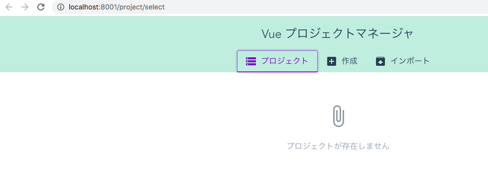
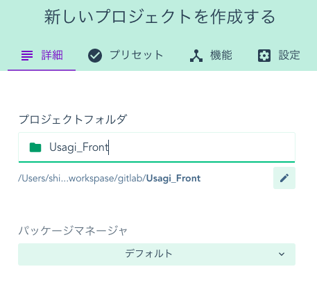
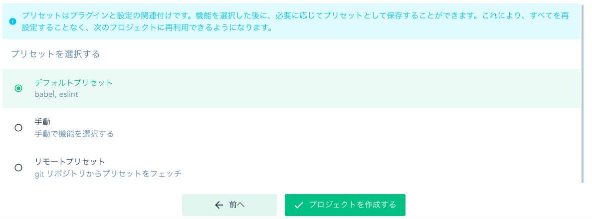
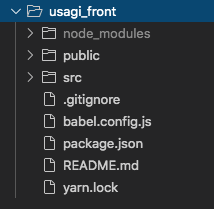

# Vue.jsでプロジェクトを構築する

---
## ■Vue公式

https://jp.vuejs.org/v2/guide/index.html

- VueはIE8はサポートしていない
- ECMAScript 5 準拠のブラウザはすべて対応

---
## ■Vueのインストール方法

https://jp.vuejs.org/v2/guide/installation.html

1. ダウンロードし script タグで読み込み
2. CDN
3. NPM
4. Vue CLI

実際の現場では`Vue CLI`を利用してVueプロジェクトの雛型を作る事が多いらしい。

＞＞＞４の方法でインストールする事を考える。

---
## ■一緒に利用する想定のもの

|ライブラリ名|説明|ライセンス|
|:--|:--|:--|
|Vuetiry|Vue向けのマテリアルデザインフレームワーク。|未調査|
|Vuex|データストアライブラリ。コンポーネント間で共通のストアを提供する。|未調査|
|Vue Router|SPAで画面遷移を提供するライブラリ。|未調査|

Vuex, Vue Routerについてはプロジェクト作成時に設定で一緒に入れられそう。

---
## ■Vue CLIを利用したVueプロジェクトのセットアップ

`Vue CLI`のライセンスはMIT。

### - Vue CLIのインストール

https://cli.vuejs.org/guide/installation.html

```
npm install -g @vue/cli
```

調べると@がついていいないのもあるが、こちらは古いバージョン。

### - Vue CLIバージョン確認

```
vue --version
@vue/cli 4.3.0
```

### - コマンドラインベースでVueプロジェクトを作成する場合

#### プロジェクト作成場所で以下のコマンドを実施
```
vue create [プロジェクト名]
```

#### マニュアルインストールを選択
```
? Please pick a preset: 
  default (babel, eslint) 
❯ Manually select features 
```

#### 一緒に導入するものを選択
```
? Check the features needed for your project: 
 ◉ Babel
 ◉ TypeScript
 ◯ Progressive Web App (PWA) Support
 ◉ Router
 ◉ Vuex
 ◉ CSS Pre-processors
 ◉ Linter / Formatter
❯◉ Unit Testing
 ◯ E2E Testing
 ```

#### 導入する内容について詳細に選択

```
? Use class-style component syntax? (Y/n) Y
```

> クラススタイルでの記述によってコンポーネントを作成する。
> VueをTypeScriptかつクラス属性で書くためのツールをインストールしてくれる。
> class宣言でコンポーネントが作成できるようになる。
> TypeScript を有効にした場合。

```
? Use Babel alongside TypeScript (required for modern mode, auto-detected polyfills, transpiling JSX)? (Y/n) Y
```

> 自動検出されたポリフィルに Babel と TypeScript を使うかどうか。
> TypeScript を有効にした場合。
> ポリフィルは、機能をサポートしないWebブラウザーで機能を実装するコードです。
> ほとんどの場合、HTML5 Web標準を実装するJavaScriptライブラリを指します。

```
? Use history mode for router? (Requires proper server setup for index fallback in production) (Y/n) Y
```

> Router に履歴モードを使うかどうか。
> Router を有効にした場合。
> vue-routerにはhashモードとhistoryモードがある。
> 
> 違い↓
> -http://localhost:8080/#/about
> -http://localhost:8080/about


```
? Pick a CSS pre-processor (PostCSS, Autoprefixer and CSS Modules are supported by default): (Use arrow keys)
❯ Sass/SCSS (with dart-sass) 
  Sass/SCSS (with node-sass) 
  Less 
  Stylus 
```

> CSS プリプロセッサに何を使うか。
> CSS Pre-processors を有効にした場合。
> Dart Sassでいいか。

```
? Pick a linter / formatter config: 
  ESLint with error prevention only 
  ESLint + Airbnb config 
  ESLint + Standard config 
❯ ESLint + Prettier 
  TSLint (deprecated) 
```

> フォーマッターの選択。
> Linter / Formatter を選択した場合。

```
? Pick additional lint features: (Press <space> to select, <a> to toggle all, <i> to invert selection)
❯◉ Lint on save
 ◯ Lint and fix on commit
```

> フォーマッターのタイミングの選択。
> Linter / Formatter を選択した場合。

```
? Pick a unit testing solution: 
  Mocha + Chai 
❯ Jest 
```

> テストツールの選択。
> Unit Testing を選択した場合。

```
? Where do you prefer placing config for Babel, ESLint, etc.? (Use arrow keys)
❯ In dedicated config files 
  In package.json 
```

> 各種設定をどこに置くか。

```
? Save this as a preset for future projects? (y/N) y
? Save preset as: [プリセット名]
```

> この設定をプリセットとして記憶するかどうか。
> 次回プロジェクトを生成するときに同じ設定ですぐ作成できるようになる。


＞＞＞質問に答えていくとプロジェクトが作成される。

---
### - GUIベースでVueプロジェクトを作成する場合

以下のコマンドを実行するとブラウザが起動し、GUIでプロジェクト作成が可能。

```
vue ui
```

Vue UIで起動した後



新しいプロジェクトを作成する



プラグインの設定



Vueでプロジェクト作成した後




※GUIは参考です。

---
## ■サーバ起動確認する

`npm` `yarn`のどちらを適用しているかで起動は変わる。

```
npm run serve
　　OR
yarn serve
```

`http://localhost:8080/`にアクセスしてVueの初期画面が表示されればプロジェクト作成成功。

---
## ■Gitで管理

- GitHub側で空のリポジトリを作成する。
- 既存プロジェクトをpushするためのコマンドが表示されるので、それを使ってVueプロジェクトをpushする。

```
git init

git add .
git commit -m "Initial commit"

git remote add origin git@github.com:s-onishi-x/Usagi_Front.git
git push -u origin master
```

---
## ■GitでプロジェクトをCloneしてから実施する事

README.mdにも記載があるが、プロジェクトに移動してプラグインを用意する必要がある。

```
yarn install
```

---
## ■Vuetiryを導入する

https://vuetifyjs.com/ja/getting-started/quick-start/

Vueでプロジェクトを作成したら、プロジェクト内で以下を実行。
```
vue add vuetify
```

プリセット選択。
```
? Choose a preset: (Use arrow keys)
❯ Default (recommended) 
  Prototype (rapid development) 
  Configure (advanced) 
```

VuetifyをつかうためにNuexを導入
```
yarn add @nuxtjs/vuetify -D
```
