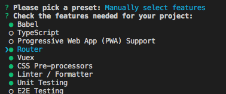
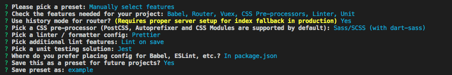

# Vue.jsでプロジェクトを構築する
## ■やりたい事

- Vueプロジェクトの構築
- Vuetifyを使ってマテリアルデザインのページを作る

## ■Vue公式

https://jp.vuejs.org/v2/guide/index.html

- VueはIE8はサポートしていない
- ECMAScript 5 準拠のブラウザはすべて対応

## ■Vueのインストール方法

https://jp.vuejs.org/v2/guide/installation.html

1. ダウンロードし script タグで読み込み
2. CDN
3. NPM
4. Vue CLI

実際の現場では`Vue CLI`を利用してVueプロジェクトの雛型を作る事が多いらしい。
４の方法でインストールする事を考える。

## ■一緒に利用する想定のもの

|ライブラリ名|説明|ライセンス|
|:--|:--|:--|
|Vuetiry|Vue向けのマテリアルデザインフレームワーク。|未調査|
|Vuex|データストアライブラリ。コンポーネント間で共通のストアを提供する。|未調査|
|Vue Router|SPAで画面遷移を提供するライブラリ。|未調査|

Vuex, Vue Routerについてはプロジェクト作成時に設定で一緒に入れられそう。

### ■Vue CLIを利用したVueプロジェクトのセットアップ

`Vue CLI`のライセンスはMIT。

#### - Vue CLIのインストール

https://cli.vuejs.org/guide/installation.html

```
npm install -g @vue/cli
```

調べると@がついていいないのもあるが、こちらは古いバージョン。

#### - バージョン確認

```
vue --version
@vue/cli 4.3.0
```

#### - コマンドラインベースでVueプロジェクトを作成する場合

```
vue create [プロジェクト名]
```





＞＞＞質問に答えていくとプロジェクトが作成される。

`vue ui`コマンドでもプロジェクト作成できそう。
こちらはブラウザが立ち上がってくるGUIベース。

---

#### - GUIベースでVueプロジェクトを作成する場合

以下のコマンドを実行すると、ブラウザが起動する。

```
vue ui
```

Vue UIで起動した後


新しいプロジェクトを作成する


プラグインの設定


Vueでプロジェクト作成した後


※GUIは参考です。

## サーバ起動確認する

`npm` `yarn`のどちらを適用しているかで起動は変わる。

```
npm run serve
　　OR
yarn serve
```

`http://localhost:8080/`にアクセスしてVueの初期画面が表示されればプロジェクト作成成功。

## Gitで管理

- GitHub側で空のリポジトリを作成する。
- 既存プロジェクトをpushするためのコマンドが表示されるので、それを使ってVueプロジェクトをpushする。

```
git init

git add .
git commit -m "Initial commit"

git remote add origin git@github.com:s-onishi-x/Usagi_Front.git
git push -u origin master
```

## GitでプロジェクトをCloneしてから

README.mdにも記載があるが、プロジェクトに移動してプラグインを用意する必要がある。

```
yarn install
```