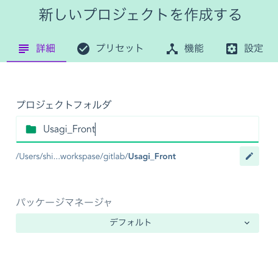
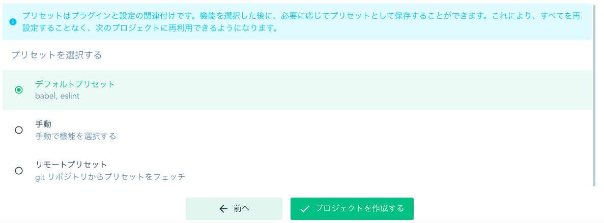
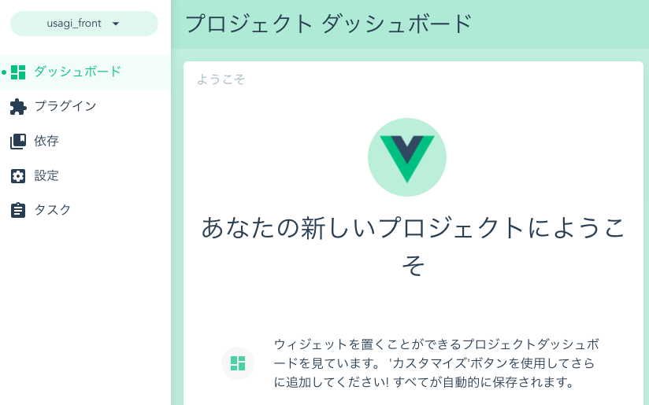
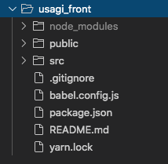

# Vue.jsでプロジェクトを構築する
## やりたい事
- Vueプロジェクトの構築
- Vuetifyを使ってマテリアルデザインのページを作る

## 利用する想定のもの
|ライブラリ名|説明|ライセンス|
|:--|:--|:--|
|Vue|JSのフレームワーク。Reactと比べるとHTMLに近い感じ。|未調査|
|Vuetiry|Vue向けのマテリアルデザインフレームワーク。|未調査|
|Vuex|データストアライブラリ。コンポーネント間で共通のストアを提供する。|未調査|
|Vue Router|SPAで画面遷移を提供するライブラリ。|未調査|
＞＞＞ライブラリについては、プロジェクト作製あとに必要になったタイミングで導入する事にする。

## Vue公式
https://jp.vuejs.org/v2/guide/index.html

## 注意点
- VueはIE8はサポートしていない
- ECMAScript 5 準拠のブラウザはすべて対応

## Vueのインストール方法
https://jp.vuejs.org/v2/guide/installation.html
1. ダウンロードし script タグで読み込み
2. CDN
3. NPM
4. CLI

実際の現場では`Vue CLI`を利用してVueプロジェクトの雛型を作る事が多いらしい。

### Vue CLIを利用したインストールについて
`Vue CLI`のライセンスはMIT。

1. Vue CLIのインストール
   https://cli.vuejs.org/guide/installation.html
```
npm install -g @vue/cli
```
@ついていいないのもあるが、こちらは古いバージョン。

バージョン確認
```
vue --version
@vue/cli 4.3.0
```

- Vue CLI を利用してVueプロジェクトを作成する場合
```
vue create [プロジェクト名]
```
`vue ui`もプロジェクト作成できそう。こちらはブラウザが立ち上がってくるらしい。

```
? Please pick a preset: default (babel, eslint)
? Pick the package manager to use when installing dependencies: Yarn
```
＞＞＞質問に答えていくとプロジェクトが作成される。

---
- vue ui を利用して、プロジェクト名、場所を指定しデフォルトのPJを作成する場合。
   デフォルトではbabel, eslintが入っている模様
   中身を見た感じではnpmではなくyarnになっていそう

Vue UIで起動した後


新しいプロジェクトを作成する


プラグインの設定


Vueでプロジェクト作成した後



## サーバ起動確認
`npm` `yarn`のどちらを適用しているかで起動は変わる
```
npm run serve
yarn serve
```

`http://localhost:8080/`にアクセスしてVueの初期画面が表示されれば作製完了

## その他
以下は開発にオススメ
- Vue.js devtools

## Gitで管理
- GitHub側で空のリポジトリを作成する。
- 既存プロジェクトをpushするためのコマンドが表示されるので、それを使ってVueプロジェクトをpushする。

```
git init

git remote add origin git@github.com:s-onishi-x/Usagi_Front.git
git add .
git commit -m "Initial commit"
git push -u origin master
```
